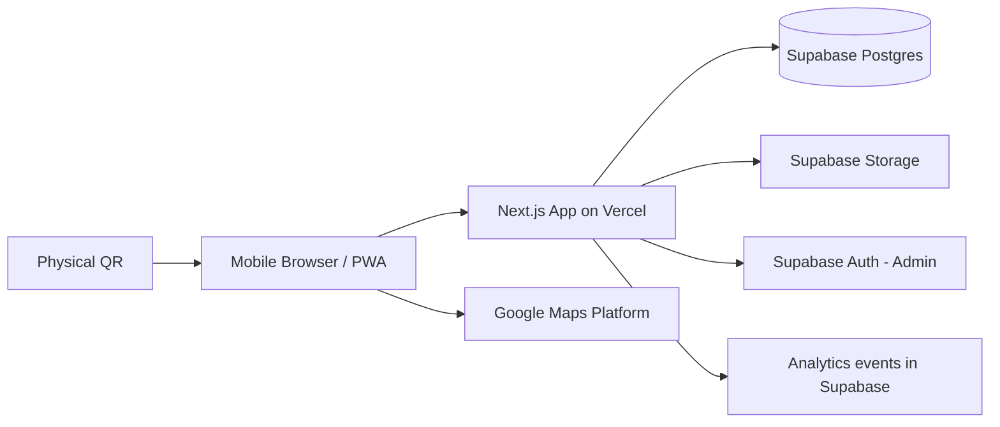

# מסמך אפיון מוצר וטכנולוגיה — סיור סליחות אינטראקטיבי בירושלים

**שם עבודה:** ירושלים — אין כמו בעולם | סיור סליחות דיגיטלי  
**גרסה:** 1.0  
**פלטפורמה:** Web App / PWA במובייל  
**Frontend + Backend:** React באמצעות Next.js, פריסה ב‑Vercel  
**Database/Auth/Storage:** Supabase  
**מפות וניווט מומלץ:** Google Maps Platform — מפה אינטראקטיבית + מסלולי הליכה, עם ניווט רגלי מותאם בתוך האתר ופתיחה אופציונלית של Google Maps לניווט מלא

---

## 1. תקציר המוצר

המוצר הוא אתר אפליקטיבי, Mobile‑First, שמלווה מבקרים בסיור סליחות עצמאי בין **5 נקודות ציון בירושלים**. האתר מזהה את מיקום המשתמש (לאחר קבלת הרשאה), מציג את נקודת ההתחלה הקרובה ביותר, ובמקביל מציע מסלול מומלץ שמתחיל ב־**בית הרב קוק**.

לאחר בחירת נקודה, המשתמש מקבל מסלול הליכה מתוך האתר. כאשר הוא מגיע לנקודה, הוא מחפש QR פיזי המוצב במקום. סריקת ה‑QR פותחת בתוך האתר את תוכן התחנה, ובמרכזו סרטון. לאחר הצפייה המשתמש מתקדם לנקודה הבאה, עד להשלמת כל חמש התחנות.

החוויה צריכה להרגיש כמו אפליקציה ולא כמו אתר מידע: מסך מלא במובייל, כפתורים גדולים, מפה חיה, מיקום נוכחי, חץ כיוון, הוראות צעד‑אחר‑צעד, שמירת התקדמות, אנימציות עדינות ושפה גרפית המבוססת על הפלייר הקיים — כחול ירושלמי כהה, טורקיז/מנטה זוהר, לבן ונגיעות אבן ירושלמית.

---

## 2. מטרות עסקיות ומוצריות

1. לאפשר סיור עצמאי ללא מדריך ובקצב של המשתמש.
2. להוביל את המשתמש בפועל בין חמש נקודות ציון בצורה פשוטה וברורה.
3. ליצור תחושת משחק/מסע: הגעה → סריקה → צפייה → פתיחת התחנה הבאה.
4. לשמור על חוויית שימוש מצוינת גם למשתמש שאינו טכנולוגי.
5. לאסוף נתוני שימוש אנונימיים: התחלת סיור, בחירת מסלול, סריקות, צפיות והשלמת סיור.
6. לאפשר למנהל המערכת לעדכן נקודות, סרטונים, סדר, טקסטים ו‑QR ללא שינוי קוד.
7. לבנות תשתית שניתן להרחיב בעתיד לסיורים נוספים, שפות נוספות ואירועים נוספים.

---

## 3. קהלי יעד

- משפחות וקבוצות שמגיעות לסיורי סליחות בירושלים.
- מבקרים יחידים שרוצים סיור עצמאי.
- תיירים/מבקרים שאינם מכירים היטב את מרכז ירושלים.
- קבוצות מאורגנות שמעוניינות להתחיל מנקודה מסוימת אך להתנהל עצמאית.

### הנחות שימוש

- רוב השימוש יהיה בטלפון נייד ובחוץ.
- המשתמש עשוי להיות בתנועה, בשמש, ברחוב רועש או עם קליטה לא יציבה.
- יש לתכנן מסכים עם מעט טקסט, היררכיה חזקה וכפתורים גדולים.
- אין להסתמך על GPS כאמצעי אימות קשיח; באזורים בנויים בירושלים הדיוק יכול להשתנות.

---

## 4. נקודות הציון

בשלב זה מוגדרות 5 תחנות, כאשר תחנה 1 המומלצת היא **בית הרב קוק**. ארבע התחנות הנוספות יוזנו במערכת הניהול לאחר שייקבעו סופית.

| # | נקודה | סטטוס | תפקיד במסלול |
|---|---|---|---|
| 1 | בית הרב קוק | ידוע | נקודת פתיחה מומלצת |
| 2 | נקודה 2 | להשלמה | תחנה במסלול |
| 3 | נקודה 3 | להשלמה | תחנה במסלול |
| 4 | נקודה 4 | להשלמה | תחנה במסלול |
| 5 | נקודה 5 | להשלמה | תחנה במסלול |

כל תחנה תכיל: שם, תיאור קצר, כתובת, Latitude/Longitude, סדר במסלול, רדיוס הגעה, סרטון, תמונת קאבר, טקסט לאחר הסרטון, QR פעיל, סטטוס פרסום ושדה “נקודת פתיחה מומלצת”.

---

## 5. מסע משתמש — Flow מרכזי

### 5.1 כניסה ראשונה

1. המשתמש נכנס לאתר דרך קישור/פרסום/QR כללי.
2. מוצג מסך פתיחה ממותג עם CTA: **“מתחילים את הסיור”**.
3. לאחר לחיצה מוצג הסבר קצר: “כדי למצוא את התחנה הקרובה ולהוביל אותך במסלול נבקש גישה למיקום שלך”.
4. רק לאחר פעולה יזומה נפתחת בקשת הרשאת המיקום של הדפדפן.
5. אם המיקום אושר — מחשבים את התחנה הקרובה.
6. אם המיקום נדחה — ממשיכים עם מסלול מומלץ מבית הרב קוק ומאפשרים לבחור ידנית תחנה על המפה.

### 5.2 בחירת התחלה

במסך “מאיפה מתחילים?” יוצגו שתי אפשרויות עיקריות:

- **הכי קרוב אליי** — כרטיס עם שם התחנה, מרחק משוער וזמן הליכה.
- **המסלול המומלץ** — מתחיל בבית הרב קוק.

מתחת אפשרות שלישית משנית: **“לבחירת תחנה על המפה”**.

### 5.3 ניווט לתחנה

לאחר בחירה:

1. נפתח מסך מפה במסך כמעט מלא.
2. מיקום המשתמש מסומן בחץ/סמן חי.
3. המסלול הרגלי מסומן בקו ברור.
4. בראש/בתחתית המסך מוצגת הוראת הניווט הנוכחית, למשל “בעוד 80 מ׳ פנה שמאלה”.
5. מוצגים מרחק שנותר וזמן משוער.
6. המפה עוקבת אחרי המשתמש ויכולה להסתובב בהתאם לכיוון התנועה/מצפן, אם המכשיר מאפשר.
7. אם המשתמש סטה משמעותית מהמסלול — מתבצע חישוב מסלול מחדש.
8. כפתור קבוע: **“פתח ניווט מלא ב‑Google Maps”** למי שמעדיף אפליקציית ניווט ייעודית.

### 5.4 הגעה לתחנה

כאשר המשתמש נכנס לרדיוס משוער של התחנה (לדוגמה 35–60 מטר, ניתן להגדרה):

- מוצגת הודעה: **“הגעתם לתחנה! חפשו את ה‑QR במקום וסרקו אותו.”**
- הגעה לפי GPS אינה פותחת את הסרטון לבדה.
- יש כפתור “סריקת QR” מתוך האתר, ובמקביל ה‑QR הפיזי ניתן לסריקה גם באמצעות מצלמת הטלפון הרגילה.

### 5.5 סריקת QR וצפייה

ה‑QR יכיל URL כגון:

`https://domain.co.il/q/<public-token>`

לאחר הסריקה:

1. השרת מאמת שה‑token פעיל ומשויך לתחנה.
2. נשמר אירוע `qr_scanned` עבור הסשן האנונימי.
3. התחנה מסומנת כ־Unlocked.
4. המשתמש מועבר למסך התחנה.
5. הסרטון מוצג בתוך האתר, ללא יציאה ל‑YouTube/דפדפן חיצוני.
6. לאחר הצפייה, או לאחר מעבר סף צפייה שנגדיר (למשל 90%), התחנה מסומנת כ־Completed.
7. מופיע CTA: **“ממשיכים לתחנה הבאה”**.

### 5.6 מעבר לתחנה הבאה

ברירת המחדל היא סדר מסלול שהוגדר מראש במערכת הניהול. אם המשתמש התחיל בתחנה הקרובה אליו ולא בתחנה הראשונה, הסדר “מסתובב” מאותה תחנה וממשיך לפי הסדר המוגדר, כולל חזרה לתחנות שטרם בוצעו.

דוגמה לסדר: `1 → 2 → 3 → 4 → 5`.  
אם התחילו ב־3: `3 → 4 → 5 → 1 → 2`.

בעתיד ניתן להוסיף מצב “התחנה הקרובה הבאה” אם אין חשיבות לסדר תוכני.

### 5.7 סיום הסיור

לאחר השלמת 5/5:

- מסך חגיגי “השלמתם את סיור הסליחות בירושלים”.
- תקציר התחנות שבוצעו.
- כפתורי שיתוף.
- CTA אופציונלי: סיור נוסף / אתר העירייה / טופס משוב.

---

## 6. ניווט רגלי מתוך האתר — החלטה טכנולוגית

### היעד

לייצר חוויה שדומה ככל האפשר לניווט רגלי: חץ מיקום, מפה שנעה עם המשתמש, מסלול, הוראות פנייה, מרחק לפנייה הבאה וחישוב מחדש.

### מה אפשר לעשות בווב

אפשר לבנות ניווט רגלי עשיר בתוך האתר באמצעות Google Maps JavaScript API / Routes Library: לקבל מסלול הליכה, גיאומטריית מסלול והוראות שלבים, ולהציג אותן על מפה חיה. במקביל משתמשים ב־`navigator.geolocation.watchPosition()` למעקב רציף וב־Device Orientation/heading כאשר זמין.

### מגבלה חשובה

דפדפן אינו אפליקציית ניווט Native. לכן לא נכון להבטיח חוויה זהה ב‑100% ל‑Google Maps: רקע/נעילת מסך, מצפן, תדירות GPS והרשאות שונות בין iOS ו‑Android. לכן האפיון כולל **שתי שכבות**:

1. **ניווט בתוך האתר** — ברירת המחדל, ממותג ומלא ככל האפשר.
2. **Fallback “פתח ב‑Google Maps”** — מפעיל ניווט רגלי מלא באפליקציית Google Maps/דפדפן כאשר המשתמש רוצה זאת.

### רכיבי ניווט בתוך האתר

- Follow‑mode עם מיקום המשתמש במרכז.
- סמן משתמש בצורת חץ, לא רק נקודה.
- סיבוב הסמן לפי heading.
- סיבוב המפה לפי heading במצב “Follow”.
- Polyline למסלול.
- כרטיס הוראה נוכחית.
- מרחק לפנייה הבאה.
- ETA ומרחק כולל.
- Recenter.
- Compass.
- “סטית מהמסלול” וחישוב מחדש.
- זיהוי “קרוב לתחנה”.
- מניעת כיבוי מסך באמצעות Screen Wake Lock כאשר נתמך ובאישור המשתמש.
- בעתיד: הקראת הוראות באמצעות Web Speech API, עם בדיקת איכות עברית בפועל.

---

## 7. ארכיטקטורה מומלצת



### Frontend

- Next.js (React, App Router)
- TypeScript strict
- Tailwind CSS
- רכיבי UI נגישים; ניתן להשתמש ב‑shadcn/ui עבור אזור הניהול בלבד או כבסיס לרכיבים
- Motion לאנימציות עדינות
- PWA installability + manifest + service worker
- RTL מלא בעברית

### Backend

- Next.js Route Handlers / Server Actions על Vercel
- לוגיקה רגישה בצד שרת: אימות QR, יצירת Signed URL לסרטון, עדכון התקדמות, Admin mutations
- Rate limiting לנקודות API רגישות

### Supabase

- Postgres — תחנות, מסלולים, סשנים, התקדמות, אירועים
- Auth — משתמשי Admin בלבד בשלב ראשון
- Storage — סרטוני תחנות ותמונות
- RLS — חסימת כתיבה ישירה מהלקוח למידע ניהולי

### Google Maps

- Maps JavaScript API להצגת המפה
- Routes Library / walking routing לחישוב מסלולים
- Google Maps URLs כפתרון fallback לניווט מלא מחוץ לאתר

---

## 8. מבנה מסכים

### `/` — Landing

- לוגו/כותרת הפרויקט.
- ויז׳ואל ירושלמי ברוח הפלייר.
- כותרת קצרה: “5 תחנות. סיפור אחד. ירושלים בלילה.”
- CTA “מתחילים את הסיור”.
- קישור קטן: “איך זה עובד?”.

### `/start` — הרשאת מיקום ובחירת התחלה

- הסבר הרשאה.
- סטטוס מיקום.
- כרטיס “הכי קרוב אליי”.
- כרטיס “המסלול המומלץ — בית הרב קוק”.
- “בחרו תחנה על המפה”.

### `/tour` — מפת הסיור

- 5 markers ממוספרים.
- מצב לכל תחנה: נעולה / הבאה / הושלמה.
- Progress 0/5 עד 5/5.
- CTA לתחנה הנוכחית.

### `/navigate/[stationSlug]` — ניווט חי

- מפה 100dvh.
- חץ מיקום.
- קו מסלול.
- הוראה נוכחית.
- ETA / מרחק.
- Recenter.
- כפתור Google Maps.
- הודעת הגעה ו‑CTA לסריקת QR.

### `/scan` — סורק QR פנימי

- Camera view.
- מסגרת סריקה.
- fallback “הזן קוד ידנית” רק לתמיכה/מנהלים, לא במסך הראשי.

### `/q/[token]` — Deep Link מה‑QR

- אימות token.
- שחזור session.
- Unlock station.
- Redirect לתוכן התחנה.

### `/station/[slug]` — תוכן תחנה

- שם התחנה.
- תמונה קצרה/פתיח.
- Video player.
- כתוביות.
- Progress.
- CTA לתחנה הבאה.

### `/complete` — סיום

- 5/5.
- מסר סיום.
- שיתוף/משוב.

### `/admin/*`

- Login.
- רשימת תחנות.
- עריכת תחנה.
- העלאת סרטון.
- יצירה/ביטול QR.
- סדר תחנות Drag & Drop.
- Analytics בסיסי.

---

## 9. שפה עיצובית

העיצוב מבוסס על השפה הגרפית של הפלייר שסופק.

### צבעים מומלצים

- **Jerusalem Navy:** `#001B33` — רקע ראשי.
- **Deep Blue:** `#00325A` — משטחים/כרטיסים.
- **Neon Mint:** `#00F0A8` — CTA, מצב פעיל, Progress.
- **Soft White:** `#F7FBFF` — טקסט ראשי.
- **Stone Gold:** `#D8B57A` — נגיעות אבן/מורשת.
- **Muted Gray:** `#93A6B5` — טקסט משני.

### טיפוגרפיה

- `Heebo` או `Noto Sans Hebrew`.
- כותרות עבות וגדולות.
- טקסט מינימום 16px במובייל.
- כפתורי פעולה מינימום 48px גובה.

### עקרונות UI

- Mobile‑first.
- RTL מלא.
- Cards עם פינות מעוגלות, Border mint עדין.
- Gradient כהה במקום רקעים עמוסים בזמן ניווט.
- מיקרו‑אנימציות קצרות ולא “גימיקיות”.
- Safe Area ל‑iPhone.
- Bottom Sheet למידע על תחנה/הוראות ניווט.
- אין להסתיר את המפה עם יותר מדי טקסט.

---

## 10. התנהגות מיקום, פרטיות והרשאות

### מיקום

- מבקשים הרשאה רק אחרי לחיצה והסבר.
- לחיפוש התחנה הקרובה ניתן לחשב Haversine על המכשיר.
- בזמן ניווט משתמשים ב־`watchPosition` עם High Accuracy כאשר מתאים.
- אין לשמור היסטוריית GPS גולמית בבסיס הנתונים כברירת מחדל.
- אירועי Analytics ישמרו מזהי תחנות, לא קואורדינטות משתמש.

### אם הרשאת המיקום נדחית

- האתר נשאר שימושי.
- המסלול המומלץ מבית הרב קוק מוצג כברירת מחדל.
- ניתן לבחור תחנה ידנית.
- ניווט בתוך האתר ידרוש הרשאת מיקום; fallback ל‑Google Maps עדיין יכול להיות מוצע.

### פרטיות

- מסך Privacy קצר וברור.
- הסבר שהמיקום משמש לניווט ולהצגת התחנה הקרובה.
- אם משתמשים ב‑Google Maps, מידע מסוים נשלח לספק המפות לצורך חישוב/הצגת מסלול בהתאם למדיניותו.

---

## 11. QR — מנגנון ואבטחה

### מבנה

לכל תחנה יש QR token אקראי. בבסיס הנתונים נשמר hash של ה‑token ולא ה‑token הגולמי.

URL לדוגמה:

`/q/mWf9...random-token...2Q`

### תהליך

1. סריקה.
2. `GET /q/[token]`.
3. בצד שרת: hash והשוואה ל‑DB.
4. בדיקה שהקוד פעיל.
5. קישור לתחנה.
6. יצירת/שחזור session אנונימי.
7. שמירת `qr_scanned_at`.
8. פתיחת תוכן התחנה.

### Geofence רך

אפשר להוסיף בדיקת מרחק לצורך UX/מניעת שיתוף קישור, אך **לא מומלץ לחסום קשיח** משתמש רק בגלל GPS: דיוק ברחובות צפופים אינו תמיד יציב. אם המשתמש רחוק מעל רף מוגדר, ניתן להציג “נראה שאתם רחוקים מהתחנה — האם להמשיך?” או לדרוש סריקה מחדש במקום.

### החלפת QR

Admin יכול לבטל QR ולהנפיק חדש במקרה של הדפסה מחדש/דליפה.

---

## 12. וידאו

### MVP

- הסרטונים נשמרים ב‑Supabase Storage.
- Bucket פרטי.
- הלקוח מקבל Signed URL קצר‑חיים לאחר Unlock תקין.
- פורמט מומלץ: MP4 H.264, מותאם למובייל.
- Poster image לכל סרטון.
- כתוביות WebVTT בעברית.

### שיקולי ביצועים

אם הסרטונים ארוכים/כבדים או הצפיות רבות, מומלץ לעבור בהמשך לשירות Streaming ייעודי (למשל Mux) כדי לקבל adaptive bitrate ו‑analytics טוב יותר. זה אינו נדרש ל‑MVP.

---

## 13. מודל נתונים

### `stations`

- `id uuid pk`
- `slug text unique`
- `name text`
- `short_description text`
- `long_description text`
- `address text`
- `latitude double precision`
- `longitude double precision`
- `order_index int`
- `is_default_start boolean`
- `arrival_radius_m int`
- `video_path text`
- `poster_path text`
- `captions_path text`
- `is_published boolean`
- `created_at timestamptz`
- `updated_at timestamptz`

### `qr_codes`

- `id uuid pk`
- `station_id uuid fk`
- `token_hash text unique`
- `is_active boolean`
- `created_at timestamptz`
- `revoked_at timestamptz null`

### `tour_sessions`

- `id uuid pk`
- `session_key_hash text unique`
- `start_mode text` — `nearest | recommended | manual`
- `start_station_id uuid null`
- `current_station_id uuid null`
- `started_at timestamptz`
- `last_seen_at timestamptz`
- `completed_at timestamptz null`

### `session_station_progress`

- `session_id uuid fk`
- `station_id uuid fk`
- `status text` — `pending | arrived | unlocked | watching | completed`
- `arrived_at timestamptz null`
- `qr_scanned_at timestamptz null`
- `video_started_at timestamptz null`
- `video_completed_at timestamptz null`
- `completed_at timestamptz null`
- PK `(session_id, station_id)`

### `analytics_events`

- `id bigint identity pk`
- `session_id uuid null`
- `event_name text`
- `station_id uuid null`
- `metadata jsonb`
- `created_at timestamptz`

---

## 14. API / Server Actions

### Public

- `GET /api/stations` — רשימת תחנות שפורסמו.
- `POST /api/session/start` — פתיחת session.
- `POST /api/session/progress` — עדכון מצב סשן בצורה מבוקרת.
- `GET /api/stations/[slug]/video` — Signed URL רק אם התחנה unlocked.
- `POST /api/events` — Analytics מאומת/מסונן.

### QR

- `GET /q/[token]` — Deep link + validation + redirect.
- `POST /api/qr/validate` — עבור סורק פנימי.

### Admin

- CRUD stations.
- Upload/replace media.
- Generate/revoke QR.
- Reorder stations.
- Analytics summary.

---

## 15. State Management

אין צורך ב‑Redux ל‑MVP.

- Server Components לקריאת מידע סטטי/ראשוני.
- React state/context עבור מצב ניווט זמני.
- session ID ב‑HttpOnly cookie מאובטח ככל האפשר.
- Supabase כמקור אמת להתקדמות.
- LocalStorage רק כ‑fallback קטן ל‑UI, לא כמקור אמת יחיד.

---

## 16. PWA

- `manifest.webmanifest`.
- אייקונים.
- `display: standalone`.
- Theme color כחול כהה.
- Service Worker ל‑App Shell ולנתוני תחנות בסיסיים.
- Offline screen ייעודי.
- אין הבטחה לניווט מלא ללא רשת, משום שמפות וחישוב מסלול דורשים שירות חיצוני.

---

## 17. Analytics

אירועים מומלצים:

- `landing_viewed`
- `tour_started`
- `location_permission_granted`
- `location_permission_denied`
- `nearest_station_shown`
- `start_station_selected`
- `navigation_started`
- `navigation_rerouted`
- `arrived_near_station`
- `qr_scanned`
- `station_unlocked`
- `video_started`
- `video_25`
- `video_50`
- `video_90`
- `station_completed`
- `next_station_clicked`
- `open_google_maps_clicked`
- `tour_completed`

Dashboard בסיסי:

- כמה התחילו סיור.
- מאיזו תחנה התחילו.
- כמה סרקו כל תחנה.
- אחוז השלמה 1/5 … 5/5.
- Drop‑off לפי תחנה.
- כמה עברו ל‑Google Maps חיצוני.

---

## 18. נגישות

- ניגודיות גבוהה.
- תמיכה ב‑RTL וב‑zoom מערכת.
- Focus states ברורים.
- כל פעולה זמינה ללא מחוות מורכבות.
- `aria-label` לכפתורי מפה.
- כתוביות לסרטונים.
- אפשרות transcript בהמשך.
- כיבוד `prefers-reduced-motion`.
- אין להעביר מידע קריטי רק באמצעות צבע.

---

## 19. אבטחה

- Supabase Service Role לעולם לא מגיע ל‑client bundle.
- Browser keys של Google מוגבלים ב‑HTTP referrer וב‑API restrictions.
- RLS בכל טבלה חשופה.
- Admin mutations רק למשתמש מאומת.
- Signed URLs לסרטונים.
- QR tokens אקראיים וניתנים לביטול.
- Rate limiting לסריקות ואירועים.
- Zod validation לכל payload בשרת.
- CSP מותאם למפות/וידאו.
- Sanitization לכל תוכן Admin שמאפשר HTML — עדיף להימנע מ‑HTML חופשי ב‑MVP.

---

## 20. מבנה תיקיות מומלץ

```text
app/
  (public)/
    page.tsx
    start/page.tsx
    tour/page.tsx
    navigate/[stationSlug]/page.tsx
    station/[slug]/page.tsx
    complete/page.tsx
  q/[token]/route.ts
  scan/page.tsx
  admin/
    login/page.tsx
    stations/page.tsx
    stations/[id]/page.tsx
    analytics/page.tsx
  api/
    session/start/route.ts
    session/progress/route.ts
    stations/[slug]/video/route.ts
    qr/validate/route.ts
    events/route.ts
components/
  brand/
  map/
  navigation/
  station/
  video/
  ui/
lib/
  supabase/
  google-maps/
  geo/
  analytics/
  session/
  validation/
types/
public/
  icons/
  brand/
```

---

## 21. רכיבי React מרכזיים

- `<LocationPermissionCard />`
- `<NearestStationCard />`
- `<TourMap />`
- `<StationMarker />`
- `<UserHeadingMarker />`
- `<NavigationInstructionCard />`
- `<RouteProgress />`
- `<ArrivalSheet />`
- `<QrScanner />`
- `<StationVideoPlayer />`
- `<TourProgressBar />`
- `<NextStationCTA />`
- `<OfflineBanner />`

---

## 22. אלגוריתם התחנה הקרובה

1. טוענים את 5 הקואורדינטות.
2. מקבלים מיקום נוכחי.
3. מחשבים Haversine distance לכל תחנה.
4. ממיינים.
5. מציגים את הקרובה ביותר.
6. לצורך זמן הליכה מדויק, ניתן לאחר מכן לחשב Route/ETA אמיתי לתחנה הקרובה ולבית הרב קוק בלבד, כדי לא לבצע 5 בקשות Routing מיותרות.

---

## 23. Re-routing

בזמן ניווט אין לבצע חישוב מסלול מחדש בכל עדכון GPS.

המלצה:

- שמירת route geometry אחרון.
- בדיקת מרחק המשתמש מה‑polyline.
- אם סטייה מעל 25–40 מ׳ למשך כמה עדכונים — reroute.
- Debounce / cooldown של 15–30 שניות בין reroutes.
- אם המשתמש כבר קרוב מאוד ליעד — לא לבצע reroute מיותר.

---

## 24. מצבי קצה

- GPS נדחה.
- GPS לא מדויק.
- אין קליטה.
- מסלול Routing נכשל.
- משתמש סורק תחנה לא לפי הסדר.
- משתמש סורק QR שכבר הושלם.
- QR בוטל.
- סרטון לא נטען.
- רענון דף במהלך צפייה.
- פתיחת QR בדפדפן אחר/מצב פרטי.
- חזרה לסיור יום לאחר מכן.
- משתמש נמצא מחוץ לירושלים.
- תחנה הוסתרה ע״י Admin באמצע סיור.

### החלטות UX למצבי קצה

- סריקה של תחנה מחוץ לסדר: לא לחסום; להציג “מצאתם תחנה אחרת” ולאפשר לפתוח, אלא אם יוגדר מצב Strict.
- תחנה שהושלמה: להציג “כבר ביקרתם כאן” + אפשרות לצפות שוב.
- route failure: להציג קו ישר/כתובת + כפתור Google Maps.
- video failure: Retry + טקסט חלופי קצר.

---

## 25. אזור ניהול

### Stations

- שם ו‑slug.
- כתובת וקואורדינטות.
- Pin על מפה לעריכה.
- סדר.
- Default start.
- Arrival radius.
- תיאור.
- סרטון/Poster/כתוביות.
- Published.

### QR

- Generate QR.
- Preview/Download PNG/SVG להדפסה.
- Revoke.
- Regenerate.
- Print label עם שם התחנה.

### Analytics

- Sessions started.
- Completed tours.
- Funnel.
- Scans per station.
- Video completion.

---

## 26. SEO ושיתוף

למרות שהמוצר אפליקטיבי, דף הבית צריך להיות shareable:

- OpenGraph image.
- כותרת ותיאור בעברית.
- Favicon/PWA icons.
- Canonical URL.
- עמוד מידע ציבורי קצר על הפרויקט.

עמודי `/q/*` ו‑`/admin/*` יהיו `noindex`.

---

## 27. ביצועים

יעדים:

- Landing מהיר גם ברשת סלולרית.
- Lazy‑load למפה רק אחרי הכניסה למסלול.
- Lazy‑load לוידאו.
- תמונות Next/Image.
- Minimize JS במסכי תוכן פשוטים.
- Map screen הוא Client Component ייעודי.
- סרטונים מותאמים בגודל ולא העלאת קבצי מקור ענקיים.

---

## 28. שלבי פיתוח

### Phase 1 — Foundation

- Next.js + TypeScript + Tailwind.
- RTL + Design tokens.
- Supabase project/schema.
- Seed ל‑5 תחנות.

### Phase 2 — Tour flow

- Landing.
- Location permission.
- nearest/default selection.
- Map with 5 points.
- Session persistence.

### Phase 3 — Navigation

- Walking route.
- live user location.
- instruction card.
- heading arrow.
- arrival detection.
- Google Maps fallback.

### Phase 4 — QR + Video

- QR validate.
- scanner.
- video unlock.
- Signed URLs.
- progress.

### Phase 5 — Admin

- Auth.
- stations CRUD.
- media.
- QR management.
- reorder.

### Phase 6 — Polish

- PWA.
- Analytics.
- Accessibility.
- Error states.
- Cross‑device QA.

---

## 29. קריטריוני קבלה ל‑MVP

1. האתר עובד ב‑iOS Safari וב‑Android Chrome.
2. האתר מבקש Location רק לאחר CTA ברור.
3. אם התקבל Location, מוצגת תחנה קרובה בפועל.
4. תמיד קיימת אפשרות להתחיל בבית הרב קוק.
5. מוצגת מפה עם 5 תחנות ומצב התקדמות.
6. ניתן לנווט רגלית לתחנה במסלול שמצויר בתוך האתר.
7. בזמן ניווט מיקום המשתמש מתעדכן וחץ הכיוון מוצג כאשר מידע heading זמין.
8. יש הוראת פנייה נוכחית ומרחק ליעד.
9. יש כפתור לפתיחת ניווט ב‑Google Maps.
10. הגעה לרדיוס התחנה מציגה הודעת “חפשו QR”.
11. QR תקין פותח רק את התחנה שאליה הוא משויך.
12. סרטון נפתח בתוך האתר.
13. לאחר הצפייה ניתן לעבור לתחנה הבאה.
14. ההתקדמות נשמרת אחרי Refresh.
15. לאחר 5 תחנות מוצג מסך סיום.
16. Admin יכול לערוך תחנות, מדיה וסדר ללא Deploy.
17. Admin יכול לבטל ולהנפיק QR חדש.
18. אין Service Role key בקוד לקוח.
19. אין שמירת היסטוריית GPS גולמית כברירת מחדל.
20. Lighthouse/בדיקות ידניות מראות שאין חסמי נגישות קריטיים.

---

## 30. החלטות שצריך להשלים לפני Production

- שמות וכתובות מדויקות של 4 התחנות הנוספות.
- סדר תוכני סופי בין 5 התחנות.
- אורך הסרטונים והאם יש כתוביות.
- דומיין סופי.
- Google Maps Platform billing/API key.
- רדיוס הגעה לכל תחנה לאחר בדיקה פיזית בשטח.
- האם סריקה מחוץ לסדר מותרת תמיד.
- האם השלמת וידאו דורשת 90% צפייה או רק לחיצה על “המשך”.
- מסך סיום וקישור יעד לשיתוף/משוב.
- טקסט Privacy/תנאי שימוש.

---

## 31. המלצה מעשית לניווט

ל‑MVP מומלץ לבנות **Custom Walking Navigator בתוך האתר על גבי Google Maps** ולא לנסות לשכפל אפליקציית Navigation native במלואה. כך מקבלים UX ממותג, רצף מושלם מול ה‑QR והסרטונים, ובמקביל משאירים כפתור “פתח ב‑Google Maps” למשתמש שמעדיף ניווט מלא באפליקציה.

הגישה הזו מאפשרת להגיע לחוויה “כמעט כמו Google Maps” בתוך האתר, בלי לתלות את כל מסע המשתמש ביציאה לאפליקציה חיצונית.

---

## 32. מקורות טכניים רשמיים להחלטת המפות

- Google Maps JavaScript API — Routes Library: https://developers.google.com/maps/documentation/javascript/routes/overview
- Google Maps URLs — Directions / `dir_action=navigate`: https://developers.google.com/maps/documentation/urls/get-started
- Google Maps JavaScript API overview: https://developers.google.com/maps/documentation/javascript/overview
- Mapbox documentation (חלופה): https://docs.mapbox.com/

